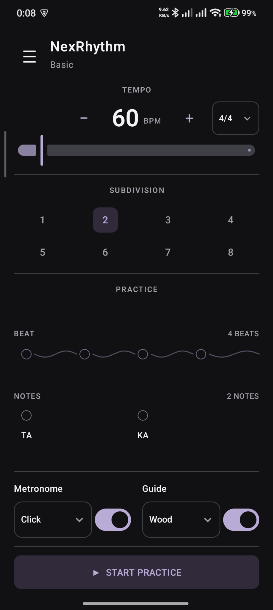
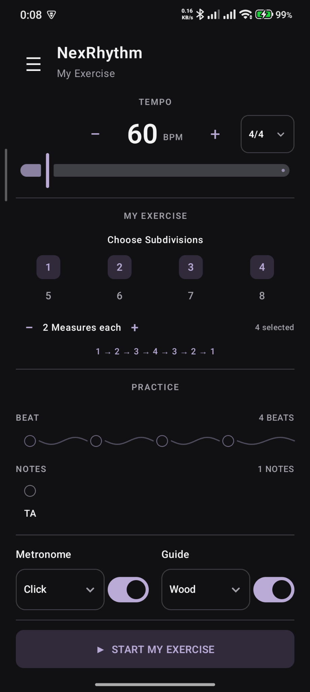
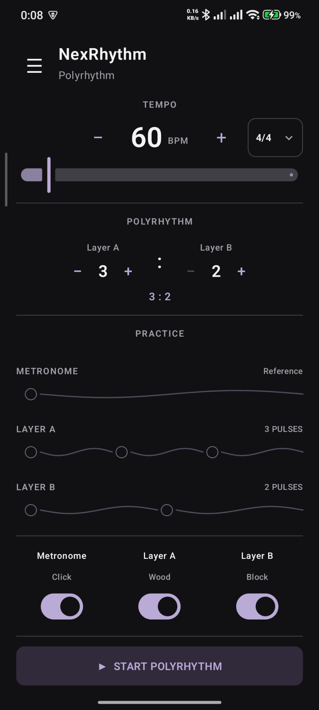
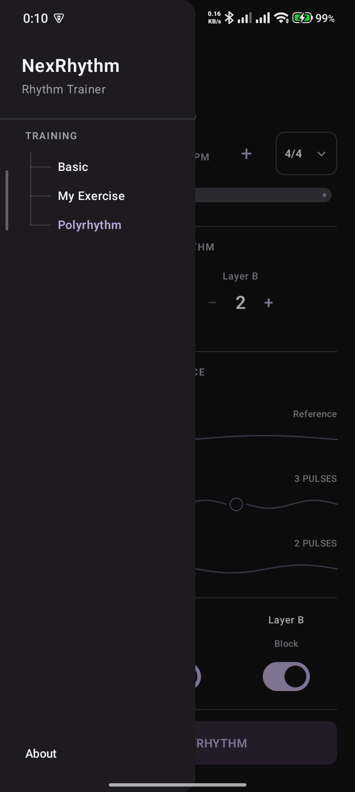

<p align="center">
  
</p>

<p align="center">
  
  
  
</p>

## Overview

NexRhythm is a focused rhythm-training application for Android, built to help musicians and learners see, hear, and internalize rhythmic structure clearly.

The current product is intentionally small and centered on three training modes:

- **Basic** — manual subdivision practice;
- **My Exercise** — custom continuous subdivision sequences;
- **Polyrhythm** — two pulse layers over the same metronome beat.

## Screenshots

<table>
  <tr>
    <th>Basic</th>
    <th>My Exercise</th>
    <th>Polyrhythm</th>
    <th>Navigation</th>
  </tr>
  <tr>
    <td></td>
    <td></td>
    <td></td>
    <td></td>
  </tr>
</table>

## Training Modes

### Basic

Practice subdivisions from **1 to 8** with visual timing feedback and optional audio guidance.

Metronome options:
- Click
- Voice Count

Guide options:
- Wood
- Snare
- Syllables

The metronome supports a distinct first-beat accent.

### My Exercise

Build a continuous exercise from selected subdivisions.

Example:

`1 → 2 → 3 → 4 → 3 → 2 → 1 → ...`

Users can:
- choose any subdivision from 1 to 8;
- configure the number of measures for each subdivision;
- run the selected sequence continuously.

### Polyrhythm

Practice two independent pulse layers over the same metronome beat.

Current ratio range:
- Layer A: **2–8**
- Layer B: **2–8**

Current sound identity:
- Metronome: Click
- Layer A: Wood
- Layer B: Block

Metronome, Layer A, and Layer B can be enabled or disabled independently.

## Time Signature

Supported numerator:

`2–24`

Supported denominator:

`2, 4, 8, 16`

BPM uses the quarter note as the reference unit.

Beat duration follows:

`beat duration = quarter-note duration × 4 / denominator`

## Product Principles

NexRhythm prioritizes:

- accurate rhythm practice;
- clear musical concepts;
- fit-to-screen training UI;
- immediate visual and audio feedback;
- small and maintainable native Android architecture;
- evidence-based promotion of experimental features.

## Technical Stack

- Kotlin
- Jetpack Compose
- Material 3
- Android `AudioTrack`
- Native Android media APIs
- No Navigation Compose
- No third-party audio playback dependency

## Build from Source

The Android application is located in:

`nexrhythm_kotlin/`

From the repository root:

```powershell
git diff --check
.\nexrhythm_kotlin\gradlew.bat -p nexrhythm_kotlin test
.\nexrhythm_kotlin\gradlew.bat -p nexrhythm_kotlin assembleDebug
```

To install a debug build on a connected Android device:

```powershell
adb devices
.\nexrhythm_kotlin\gradlew.bat -p nexrhythm_kotlin installDebug
adb shell am force-stop com.nexrhythm.app
adb shell monkey -p com.nexrhythm.app -c android.intent.category.LAUNCHER 1
```

## Installation

A public APK will be provided with the first public release.

Until then, NexRhythm can be built and installed from source using the commands above.

## Experimental / Deferred

### Rhythm Analyzer

An experimental imported-audio rhythm analyzer exists in the codebase but is intentionally hidden from the user-facing application.

Its current musical interpretation is not reliable enough for release, particularly for complex full-mix audio, tempo ambiguity, and time-signature estimation.

### Odd-Meter Grouping

Odd-meter grouping is planned as a separate musical concept from time signature.

Examples:

- `7/8 = 2+2+3`
- `7/8 = 3+2+2`
- `7/8 = 2+3+2`
- `11/8 = 3+3+3+2`

It is not currently user-facing.

## Developer

Developed by **FRIZDEV**.

## License

Copyright © 2026 FRIZDEV.

NexRhythm is licensed under the **GNU General Public License v3.0**.

See [LICENSE](LICENSE) for the full license text.
